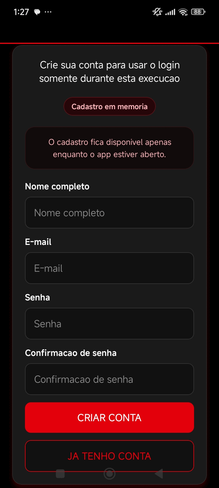
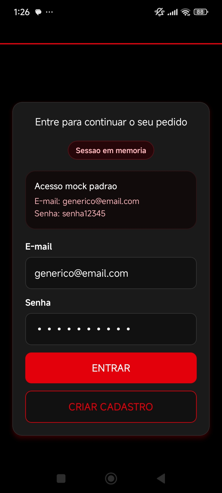
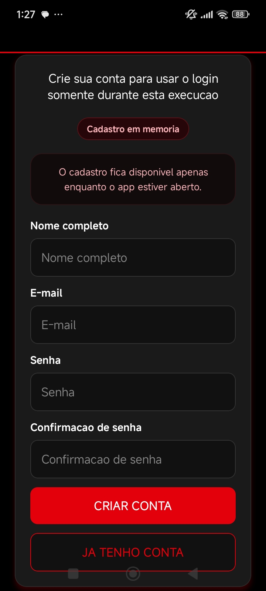
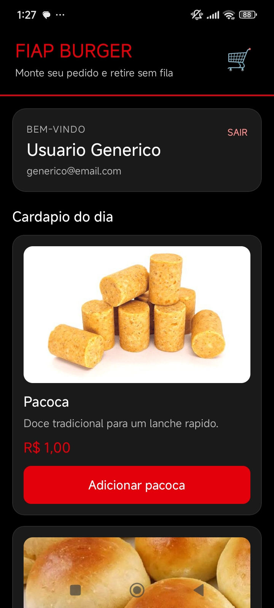
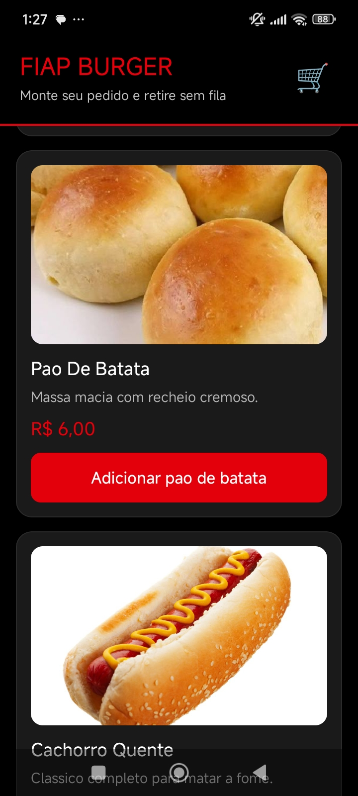
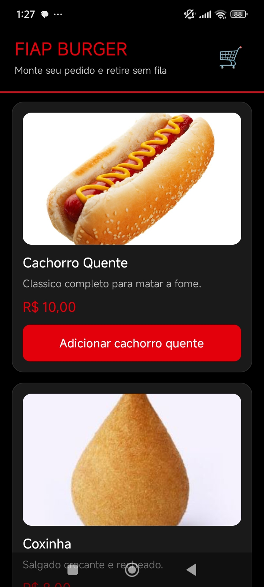
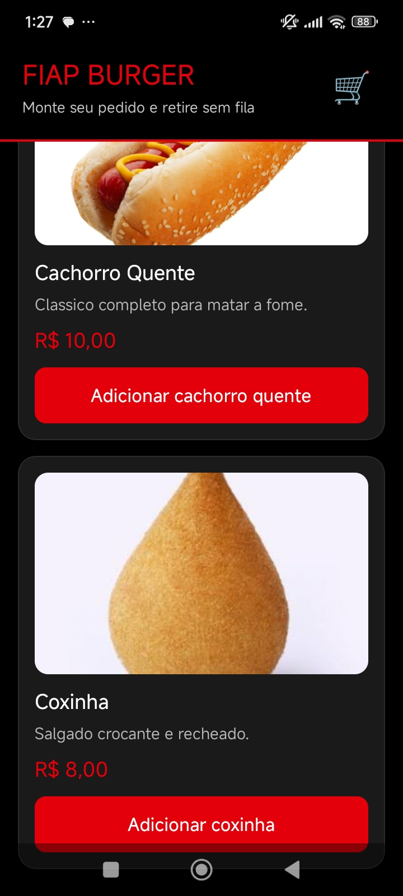
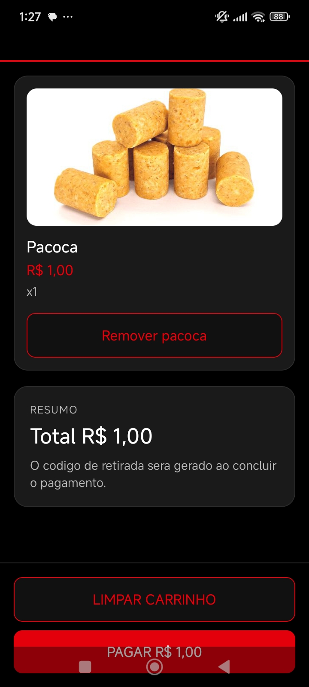
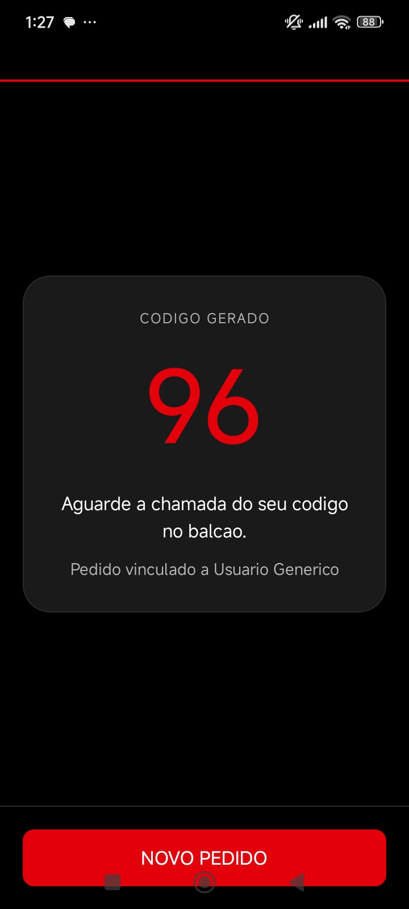

# CantinaOn

Aplicativo mobile desenvolvido com **React Native + Expo** para simular o fluxo de atendimento de uma cantina academica. O projeto permite criar conta, fazer login, visualizar o cardapio, adicionar itens ao carrinho, concluir o pedido e gerar um codigo de retirada.

Este repositorio foi construido como **trabalho academico**, mas com uma preocupacao adicional com organizacao de codigo, persistencia local onde faz sentido, testes automatizados e uma experiencia de uso mais consistente.

---

## Sumario

- [1. Visao geral](#1-visao-geral)
- [2. Objetivo do projeto](#2-objetivo-do-projeto)
- [3. Funcionalidades atuais](#3-funcionalidades-atuais)
- [4. Arquitetura e organizacao](#4-arquitetura-e-organizacao)
- [5. Tecnologias utilizadas](#5-tecnologias-utilizadas)
- [6. Estrutura de pastas](#6-estrutura-de-pastas)
- [7. Fluxo de navegacao](#7-fluxo-de-navegacao)
- [8. Galeria das telas](#8-galeria-das-telas)
- [9. Persistencia com AsyncStorage](#9-persistencia-com-asyncstorage)
- [10. Gerenciamento de estado global com Context API](#10-gerenciamento-de-estado-global-com-context-api)
- [11. Validacao de formularios](#11-validacao-de-formularios)
- [12. Testes automatizados](#12-testes-automatizados)
- [13. Conceito adicional aplicado no projeto](#13-conceito-adicional-aplicado-no-projeto)
- [14. Como executar o projeto](#14-como-executar-o-projeto)
- [15. Scripts disponiveis](#15-scripts-disponiveis)
- [16. Limitacoes atuais](#16-limitacoes-atuais)
- [17. Melhorias futuras](#17-melhorias-futuras)
- [18. Autores e orientador](#18-autores-e-orientador)
- [19. Licenca](#19-licenca)

---

## 1. Visao geral

O **CantinaOn** evoluiu de um app simples de cardapio para uma aplicacao com fluxo mais completo e mais proxima de um comportamento real de produto mobile.

Atualmente o sistema possui:

- telas separadas para **login**, **cadastro**, **menu**, **carrinho** e **codigo de retirada**;
- autenticacao mock em memoria com um usuario padrao e cadastros disponiveis apenas durante a execucao atual;
- persistencia local de carrinho e ultimo codigo gerado;
- estado global compartilhado entre as telas;
- validacao de formularios com feedback visual;
- testes automatizados para validar regras importantes do app.

---

## 2. Objetivo do projeto

O objetivo do projeto e demonstrar, na pratica, conceitos importantes de desenvolvimento mobile com React Native:

- criacao de interfaces mobile;
- navegacao entre telas;
- componentizacao;
- gerenciamento de estado local e global;
- persistencia de dados no dispositivo;
- simulacao de autenticacao com dados em memoria;
- validacao de formularios;
- testes automatizados;
- simulacao de um fluxo completo de pedido em uma cantina.

---

## 3. Funcionalidades atuais

### Autenticacao

- cadastro de usuario com:
  - nome completo
  - e-mail
  - senha
  - confirmacao de senha
- usuario mock inicial:
  - e-mail: `generico@email.com`
  - senha: `senha12345`
- login com e-mail e senha
- cadastro salvo apenas em memoria durante a execucao atual
- sessao mantida apenas enquanto o app esta aberto

### Cardapio e carrinho

- exibicao do cardapio com produtos fixos
- adicao de itens ao carrinho
- badge com quantidade de itens
- agrupamento de itens repetidos no carrinho
- remocao de itens
- limpeza total do carrinho
- calculo do valor total

### Finalizacao

- geracao de codigo de retirada
- armazenamento do ultimo codigo gerado
- retorno para um novo pedido

### UX e interface

- telas visualmente padronizadas
- feedback visual de erros em formularios
- estado de carregamento durante a leitura do armazenamento local
- separacao clara entre fluxo de autenticacao e fluxo de pedido

---

## 4. Arquitetura e organizacao

O projeto segue uma arquitetura simples, porem mais organizada do que a versao inicial.

### Camadas principais

- `pages/`
  - telas da aplicacao
- `components/`
  - componentes reutilizaveis de interface
- `context/`
  - estado global da aplicacao
- `data/`
  - dados estaticos do cardapio
- `imgDasTelas/`
  - capturas de tela usadas no README
- `test-utils/`
  - funcoes auxiliares para testes
- `__tests__/`
  - testes automatizados
- `__mocks__/`
  - mocks usados nos testes

### Decisoes arquiteturais

- **Context API** foi usada para centralizar estado global.
- **AsyncStorage** foi usado para persistencia local do carrinho e do ultimo codigo gerado.
- a autenticacao foi modelada como um mock em memoria para simular um banco local apenas em tempo de execucao.
- as telas ficaram mais enxutas, delegando logica compartilhada ao contexto.
- componentes repetidos foram extraidos para a pasta `components/`.

---

## 5. Tecnologias utilizadas

| Tecnologia | Versao | Finalidade |
| --- | --- | --- |
| `expo` | `~54.0.33` | ambiente de execucao |
| `react` | `19.1.0` | base de componentes |
| `react-native` | `0.81.5` | interface mobile |
| `@react-navigation/native` | `^7.2.0` | navegacao |
| `@react-navigation/native-stack` | `^7.14.7` | rotas em pilha |
| `@react-native-async-storage/async-storage` | `2.2.0` | persistencia local |
| `expo-status-bar` | `~3.0.9` | controle da status bar |
| `react-native-safe-area-context` | `~5.6.0` | areas seguras |
| `react-native-screens` | `~4.16.0` | integracao nativa de telas |
| `jest` | `^30.3.0` | motor de testes |
| `jest-expo` | `~54.0.17` | integracao de testes com Expo |
| `@testing-library/react-native` | `^13.3.3` | testes de interface |
| `react-test-renderer` | `19.1.0` | suporte aos testes React |

---

## 6. Estrutura de pastas

```text
CantinaOn/
|-- __mocks__/
|   `-- @react-native-async-storage/
|       `-- async-storage.js
|-- __tests__/
|   |-- App.test.js
|   |-- AppContext.test.js
|   |-- CartScreen.test.js
|   |-- LoginScreen.test.js
|   |-- MenuScreen.test.js
|   |-- PickupCodeScreen.test.js
|   `-- RegisterScreen.test.js
|-- components/
|   |-- ActionButton.js
|   |-- AuthScreenLayout.js
|   |-- FormInput.js
|   |-- LoadingScreen.js
|   `-- ScreenHeader.js
|-- context/
|   `-- AppContext.js
|-- data/
|   `-- menuItems.js
|-- imgDasTelas/
|   |-- img1.jpeg
|   |-- img2.jpeg
|   |-- img3.jpeg
|   |-- img4.jpeg
|   |-- img5.jpeg
|   |-- img6.jpeg
|   |-- img7.jpeg
|   `-- img8.jpeg
|-- pages/
|   |-- CartScreen.js
|   |-- LoginScreen.js
|   |-- MenuScreen.js
|   |-- PickupCodeScreen.js
|   `-- RegisterScreen.js
|-- test-utils/
|   `-- renderWithAppProvider.js
|-- assets/
|-- App.js
|-- app.json
|-- index.js
|-- package.json
`-- README.md
```

---

## 7. Fluxo de navegacao

O fluxo principal da aplicacao funciona assim:

1. O app inicia e carrega os dados persistidos do carrinho e do ultimo codigo.
2. A tela inicial sempre e `Login`.
3. O usuario pode entrar com o mock padrao ou ir para `Register` e criar uma conta.
4. O cadastro criado fica disponivel apenas durante a execucao atual.
5. Depois do login, acessa o `Menu`.
6. No `Menu`, adiciona produtos ao carrinho.
7. No `Cart`, revisa, remove itens ou finaliza o pedido.
8. Ao concluir, recebe um `PickupCode`.
9. Pode iniciar um novo pedido voltando ao menu.

---

## 8. Galeria das telas

As capturas abaixo estao salvas na pasta `imgDasTelas/` e mostram o fluxo principal da aplicacao.

### Gif do APP


### Login e cadastro

<p align="center">
  
  
</p>

### Menu e cardapio

<p align="center">
  
  
</p>

<p align="center">
  
  
</p>

### Carrinho e codigo de retirada

<p align="center">
  
  
</p>

---

## 9. Persistencia com AsyncStorage

O projeto utiliza **AsyncStorage** para salvar dados localmente no dispositivo.

### Dados persistidos

- itens do carrinho;
- ultimo codigo de retirada gerado.

### Dados que ficam apenas em memoria

- usuario mock padrao `generico@email.com`;
- novos usuarios cadastrados durante a execucao atual;
- sessao do usuario autenticado.

### Beneficios dessa abordagem

- o carrinho pode permanecer salvo entre aberturas;
- o ultimo codigo gerado continua visivel apos reabrir o app;
- o projeto separa claramente o que deve ser persistido do que e apenas simulacao de autenticacao;
- o app ganha um comportamento mais proximo de um sistema real;
- o projeto pratica um conceito importante de persistencia local em mobile.

---

## 10. Gerenciamento de estado global com Context API

O estado global da aplicacao foi implementado em `context/AppContext.js`.

### Estados compartilhados

- `users`
- `currentUser`
- `cartItems`
- `lastPickupCode`
- `isHydrated`

### Acoes expostas pelo contexto

- `registerUser`
- `loginUser`
- `logoutUser`
- `addItemToCart`
- `removeItemFromCart`
- `clearCart`
- `completeOrder`

### Vantagens do uso de Context API

- evita passar props manualmente entre varias telas;
- centraliza regras de negocio;
- melhora a manutencao;
- deixa a navegacao independente do estado do carrinho e da autenticacao.

Observacao importante:

- `users` e `currentUser` existem apenas em memoria durante a execucao;
- `cartItems` e `lastPickupCode` sao hidratados com AsyncStorage;
- o contexto expoe um usuario mock inicial para demonstracao e testes.

---

## 11. Validacao de formularios

As telas de login e cadastro agora possuem validacao visual de formularios.

### Login

- e-mail obrigatorio
- senha obrigatoria
- validacao de formato do e-mail
- mensagem especifica para credenciais invalidas

### Cadastro

- nome completo obrigatorio
- e-mail obrigatorio
- senha obrigatoria
- confirmacao de senha obrigatoria
- validacao de formato do e-mail
- senha com minimo de 6 caracteres
- confirmacao identica a senha
- bloqueio de e-mails duplicados

Essa validacao melhora a experiencia do usuario e evita chamadas desnecessarias para a camada de estado.

---

## 12. Testes automatizados

O projeto possui uma camada de testes automatizados com **Jest** e **React Native Testing Library**.

### O que esta sendo testado

- registro das rotas e escolha da rota inicial
- hidratacao do estado global
- persistencia de carrinho e codigo de retirada no AsyncStorage
- usuario mock padrao
- cadastro de usuario em memoria
- login e logout em memoria
- validacao de formularios
- carrinho global
- remocao e limpeza de itens
- finalizacao do pedido
- exibicao do codigo de retirada

### Arquivos de teste

- `App.test.js`
- `AppContext.test.js`
- `LoginScreen.test.js`
- `RegisterScreen.test.js`
- `MenuScreen.test.js`
- `CartScreen.test.js`
- `PickupCodeScreen.test.js`

### Ultima validacao

```bash
npm test -- --runInBand
```

Resultado validado:

- **7 suites**
- **21 testes**
- **100% aprovados no ultimo ciclo executado**

---

## 13. Conceito adicional aplicado no projeto

Um conceito que nao foi trabalhado em aula, mas que o grupo quis aplicar, foi o de **testes automatizados**.

Nossa ideia foi construir um app que nao fosse apenas visualmente funcional, mas que tambem tivesse **confiabilidade tecnica**. Para isso, os testes sao essenciais, porque ajudam a validar as funcoes mais importantes da aplicacao, identificar erros com rapidez e reduzir o risco de uma alteracao nova quebrar algo que ja estava funcionando antes.

Em outras palavras, os testes foram usados como uma camada de seguranca do projeto. Eles ajudam a:

- verificar se as regras de login e cadastro continuam corretas;
- confirmar se a persistencia local do carrinho e do codigo esta funcionando;
- validar o mock de autenticacao e o cadastro em memoria;
- validar o comportamento do carrinho e da finalizacao do pedido;
- evitar regressao quando o codigo evolui.

Mesmo nao sendo um topico exigido em aula, optamos por implementar testes porque entendemos que eles fazem parte da construcao de um software realmente funcional, confiavel e mais facil de manter.

---

## 14. Como executar o projeto

### Pre-requisitos

Antes de executar, tenha instalado:

- Node.js
- npm
- Expo Go no celular ou emulador Android/iOS

### Instalacao

```bash
npm install
```

### Execucao

```bash
npm run start
```

Depois disso, voce pode:

- pressionar `a` para abrir no Android
- pressionar `i` para abrir no iOS
- pressionar `w` para abrir na Web
- ou escanear o QR Code com o Expo Go

---

## 15. Scripts disponiveis

```bash
npm run start
npm run android
npm run ios
npm run web
npm run test
```

### Descricao

- `npm run start`: inicia o projeto com Expo
- `npm run android`: abre no Android
- `npm run ios`: abre no iOS
- `npm run web`: abre na Web
- `npm run test`: executa os testes automatizados

---

## 16. Limitacoes atuais

Apesar das melhorias, o projeto ainda possui limitacoes importantes:

- autenticacao apenas local e simulada em memoria
- senhas mantidas em texto puro durante a execucao
- sem backend real
- sem banco de dados remoto
- sem historico de pedidos
- sem integracao com pagamento
- sem controle real de estoque ou fila

Essas limitacoes sao aceitaveis para o escopo academico atual, mas seriam pontos obrigatorios de evolucao em um produto real.

---

## 17. Melhorias futuras

- integracao com backend real
- hash de senha e autenticacao segura
- historico de pedidos
- perfil do usuario
- edicao de cadastro
- produtos dinamicos vindos de API
- estoque em tempo real
- fila real de retirada
- testes end-to-end
- atualizacao do nome interno do projeto de `app-js-sdk54` para `CantinaOn`

---

## 18. Autores e orientador

**Autores:**

- RM 565437 - Leonardo Lopes Oliveira
- RM 563119 - Lucas
- RM 563462 - Cadu
- RM 564878 - Felipe Krzyzanovski

**Orientador:**

- Hercules Lima Ramos

---

## 19. Licenca

Este projeto possui finalidade **exclusivamente academica**.

Seu uso esta voltado para estudo, demonstracao e avaliacao universitaria.
